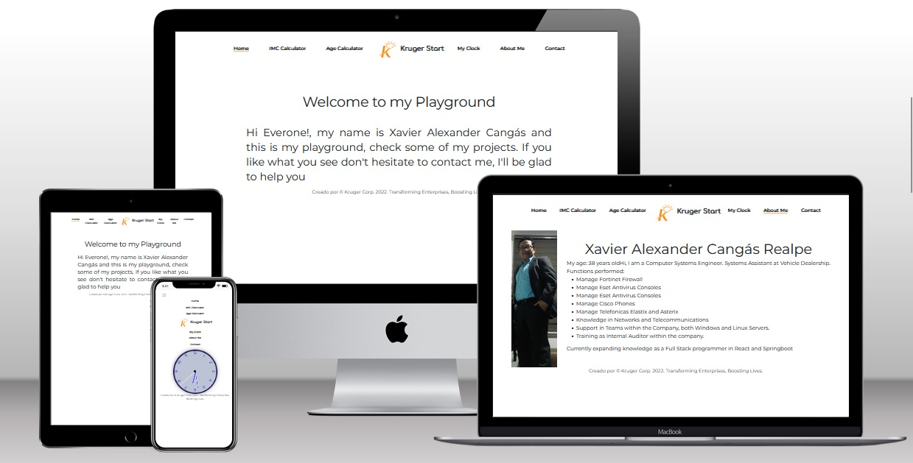

# App Playground con React

  - In this repository you can  see at small applications developer with con React, in the "[Kruger Start](https://www.youtube.com/@KrugerCorp)   "

## Built With 👣👍🧑‍🏫

- 🪵 HTML  
- 🛖 CSS
- 📚 Git
- 🚙⚙️JavaScript

## Getting Started

**In this repository I will upload some of my applications deveolped in Kruger Start.**

## Run it 🏃‍♂️🏁🏳️

Use the following steps to run this Portfolio locally:

- open the terminal

- get in the directory you want this folder to appear

- put: git clone https://github.com/xander06/hellocss

- open the folder with a code editor (VS Code preferred)

- go to the index.html file and open it with live server

### Deployment 🫣😊👌😁

For a live demo please click on the following link:

https://xanderhellocss.netlify.app/

## Authors

👤 **Xavier Alexander Cangas**

- GitHub: [@Xander06](https://github.com/xander06)
- LinkedIn: [Alexander Cangás](https://www.linkedin.com/in/alexander-c-00a2967b/)

## 🤝 Contributing

Contributions, issues, and feature requests are welcome!

## License ©️

X@NDER06
**Free Software, Yeah!**
😎🧑‍💻🆓

## Roadmap

- Additional browser support
Add
- Add more integrations
